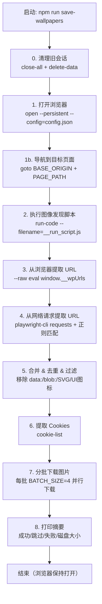
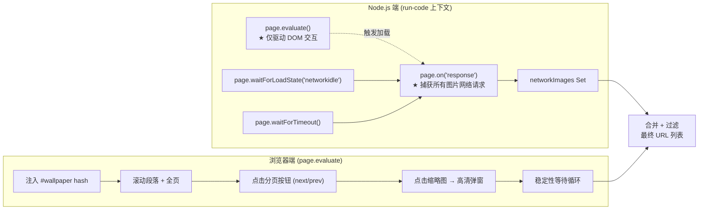
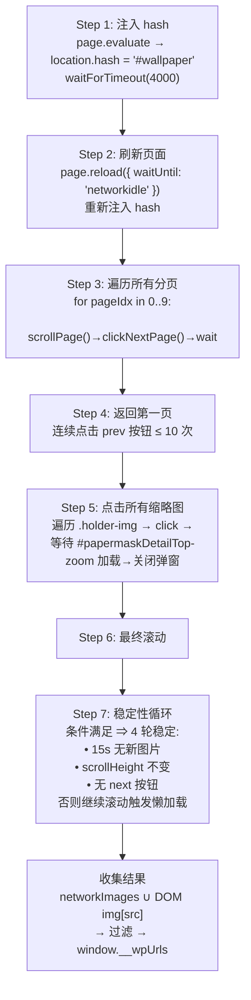
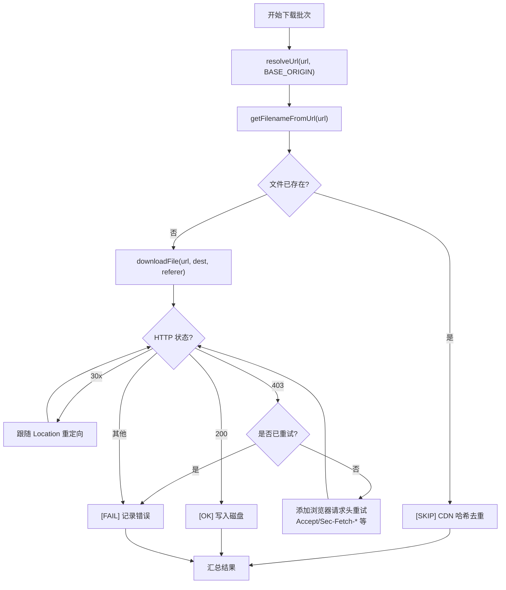

# 项目分析与会话记录 — Wallpaper Scraper

> **日期**: 2026-06-14
> **分支**: main
> **最近提交**: 9a4aaf6 — feat: Add skills to the agent to invoke and repeat task execution.

---

## 1. 项目概述

本项目是一个基于 **Playwright CLI** 的壁纸抓取工具，目标网站是 [Bluepoch](https://re.bluepoch.com/home/detail.html#wallpaper)（《重返未来：1999》官方壁纸画廊）。脚本通过真实浏览器自动化，遍历分页、滚动懒加载、点击缩略图触发高清大图加载，最终下载所有壁纸到本地。

### 技术栈

| 层 | 技术 |
|---|------|
| 运行环境 | Node.js (v18+), TypeScript (ES2022, CommonJS) |
| 浏览器自动化 | `@playwright/cli` (全局安装) |
| 配置管理 | `dotenv` 读取 `.env` |
| 脚本入口 | `ts-node src/save_wallpapers.ts` |
| 浏览器 | Chrome (headed, 1920×1080, viewport: null) |

---

## 2. 整体工作流程



---

## 3. 核心架构：Network-First 图像捕获



**核心设计理念**：网络层通过 `page.on("response")` 捕获所有真实的图片请求，DOM 端只负责触发用户行为（滚动、点击、翻页）。即使 SPA 从 DOM 中卸载了图片元素（虚拟列表），网络层已经记录了请求。

---

## 4. 图像发现子流程 (run-code 脚本内部)



**稳定性循环**是关键的终止条件：旧方案通过轮询 DOM 中图片数量判断稳定，但 SPA 会卸载已浏览的图片，导致计数永远不稳定。新方案通过三层条件联合判断：
1. 15 秒内无新的网络图片请求
2. `document.body.scrollHeight` 不再变化
3. 下一页按钮不可点击
4. 连续 4 轮均满足以上条件

---

## 5. 下载子流程



**关键设计点**:
- **403 重试机制**: CDN 可能拒绝缺少完整浏览器头的请求。首次尝试基本头（User-Agent + Cookie + Referer），若返回 403 则追加 `Accept`、`Accept-Language`、`Sec-Fetch-*` 等浏览器标准头
- **CDN 哈希去重**: CDN 文件名包含内容哈希（如 `870_1440x2560_fcdf70aa.jpg`），相同文件名 = 相同内容，直接用 `fs.existsSync` 跳过
- **Cookie 认证**: 从 Playwright 浏览器会话中提取 cookie，用于下载可能需要登录的图片

---

## 6. 项目文件结构

```
test-playwirght/
├── .env                          # 环境变量配置
├── .playwright/
│   └── config.json               # Chrome 启动配置 (headed, 1920×1080)
├── .claude/
│   └── skills/
│       ├── playwright-cli/       # Playwright CLI 操作技能
│       │   ├── SKILL.md
│       │   └── references/       # 10 个参考文档
│       └── save-images/          # 图片保存技能
│           └── SKILL.md
├── src/
│   └── save_wallpapers.ts        # 主脚本 (~650 行)
├── images/                       # 下载输出目录
├── __run_script.js               # 临时文件: 生成的 run-code 脚本 (自动清理)
├── package.json                  # 依赖: dotenv, ts-node, typescript
├── tsconfig.json                 # TypeScript 配置
├── README.md                     # 项目说明
├── CLAUDE.md                     # Claude Code 指引
├── KNOWLEDGE.md                  # 知识库
└── WORKLOG.md                    # 本文件
```

---

## 7. 环境变量 (.env)

| 变量 | 默认值 | 说明 |
|------|--------|------|
| `BASE_ORIGIN` | `https://re.bluepoch.com` | 目标网站基 URL |
| `PAGE_PATH` | `/home/detail.html` | 页面路径 |
| `SESSION_NAME` | `bluepoch` | Playwright 会话名称 |
| `IMAGES_DIR` | `images` | 下载输出目录 |
| `BATCH_SIZE` | `4` | 并行下载批次大小 |
| `PLAYWRIGHT_CONFIG` | `.playwright/config.json` | 浏览器启动配置 |
| `USER_AGENT` | Chrome 131 Windows UA | 下载时的 User-Agent |

**注意**: `PAGE_HASH`（`#wallpaper`）不能放在 `.env` 中，因为 `#` 是 `.env` 的注释符，会导致值为空。因此 hash 硬编码在 TypeScript 中。

---

## 8. 关键技术决策与坑点

| # | 问题 | 症状 | 解决方案 |
|---|------|------|----------|
| 1 | Windows cmd.exe 分割多行/将 `#` 当注释 | "too many arguments" / hash 丢失 | 写入临时文件 → `--filename` |
| 2 | `--filename` 中使用 `module.exports` | `SyntaxError: Unexpected token` | 使用普通函数表达式 `async (page) => {...}` |
| 3 | run-code 运行在 Node.js 上下文 | `window is not defined` | 使用 `await page.evaluate(...)` 访问浏览器全局 |
| 4 | SPA 卸载图片导致 DOM 计数不稳定 | 发现循环永不收敛 | Network-first: 用网络请求数 + scrollHeight + 翻页状态判断稳定 |
| 5 | `setViewportSize` → 移动端布局 | 壁纸内容不显示 | `viewport: null` + `--window-size=1920,1080` |
| 6 | CDN 拒绝缺少完整头的请求 | HTTP 403 | 首次失败后用完整浏览器头重试 |
| 7 | `uniqueFilename` 产生重复文件 | `_1`, `_2` 后缀文件内容相同 | 直接按 CDN 文件名跳过已存在文件 |
| 8 | `#` 在 `.env` 中是注释符 | `PAGE_HASH` 读取为空 | 硬编码在 TypeScript 中 |

---

## 9. Git 历史

```
9a4aaf6 feat: Add skills to the agent to invoke and repeat task execution.
5cf9115 Deduplicate images based on CDN content and hash, and add skills to the Claude code.
512bc05 feat: Remove hardcoding, add an .env file to control environment variables, and use dotenv to read them.
fe28f35 add the README.md
986dc41 init repo
```

---

## 10. Claude Code 技能集成

本项目附带两个 Claude Code 技能：

### playwright-cli
- 提供 `playwright-cli` CLI 工具的完整操作指南
- 包含会话管理、元素交互、网络拦截、存储状态、测试生成等 10 个参考文档
- 在 `.claude/skills/playwright-cli/` 目录下

### save-images
- 封装了本项目的核心逻辑和设计决策
- 记录了 8 个常见坑点和解决方案
- 提供快速启动、架构图、关键代码片段
- 在 `.claude/skills/save-images/` 目录下

---

## 11. 会话摘要

本次会话对项目进行了全面的代码审查和分析：

1. **探索了完整的项目结构** — 包括源代码、配置、技能文件、环境变量
2. **深入分析了 `save_wallpapers.ts`** — 理解每个阶段的作用和设计意图
3. **提取了核心架构模式** — Network-First 捕获、SPA Hash 注入、稳定性循环、CDN 去重
4. **使用 Mermaid 图表可视化了 5 个关键流程**:
   - 整体工作流程
   - Network-First 架构
   - 图像发现子流程
   - 下载子流程（含 403 重试）
   - 项目文件结构
5. **整理了 8 个关键设计决策和坑点表格**
6. **输出了本 WORKLOG.md 作为项目文档**

---

## 12. 会话摘要 — 模块化拆分

> **日期**: 2026-06-15
> **分支**: main
> **关联**: 基于会话 #11 的代码审查结果进行重构

### 目标

将 650 行单体文件 `src/save_wallpapers.ts` 按职责拆分为多个模块，零逻辑变更，提升可维护性。

### 决策树遍历

#### 决策 1: 模块化层级

讨论了三个层级：
- **A. 文件级拆分** — `save_wallpapers.ts` 拆成几个文件，仍是一个应用
- **B. 可复用工具库** — 抽象通用爬虫/下载模块，Bluepoch 作为"策略"
- **C. 多站点框架** — Scrapy 式架构，Spider/Pipeline/Middleware

**选择: A** — 用户偏好简单方案，项目当前只有单一抓取目标。

#### 决策 2: NestJS 框架？

用户提议引入 NestJS 实现模块化。经过分析后否决：

| 维度 | 项目实际需求 | NestJS 提供 |
|------|-------------|------------|
| 运行模式 | CLI 脚本 `npm run save-wallpapers` | HTTP Server 监听端口 |
| 核心逻辑 | 浏览器自动化 + 图片下载 | 请求/响应中间件管道 |
| CLI 调用 | `execSync` 调 Playwright CLI | 无此概念 |
| 输出 | 图片到磁盘 | 响应序列化 |
| 基础设施 | 无 API/路由/数据库 | Controller/Route/ORM 集成 |

**结论**: NestJS 是 HTTP 框架，与 CLI 脚本项目完全不匹配。放弃。

#### 决策 3: 拆分方案

两个方案：
- **方案 ① (4 文件)**: config / download / scraper / main
- **方案 ② (5-6 文件)**: 额外拆分 playwright / cookie

**选择: 方案 ①** — `pwc`、Cookie、URL 工具都是小函数，独立成文件增加 import 开销。

#### 决策 4: `buildRunCodeScript()` 处理

- **a. 保留 TypeScript 函数** → 在 `scraper.ts` 中
- **b. 拆为独立 `.js` 文件** → `fs.readFileSync` 加载

**选择: a** — 保持 TypeScript 类型检查，模板变量替换有类型提醒。

#### 决策 5: `pwc` 的归属和注入

- **a. 放 `config.ts`** → 混合工具 + 配置
- **b. 保留在 `main.ts`，通过参数注入** → `getCookieHeader(pwc)`、`extractNetworkImageUrls(pwc)`

**选择: b** — 纯函数可测试，避免 `config.ts` 依赖 `child_process`。

#### 决策 6: 共享类型和 Cookie 缓存

- **a. 类型就地定义 + Cookie 保持闭包缓存**
- **b. 新增 `types.ts` + 缓存提升为调用方控制**

**选择: a** — `DownloadResult` 只有一个消费者，`_cachedCookieHeader` 闭包是合理的封装。

#### 决策 7: 文件职责分配

确认每个文件的最终归属：

```
src/
├── config.ts       # .env 读取 + 所有常量
├── download.ts     # HTTP 下载 + Cookie 提取 + URL 工具
├── scraper.ts      # buildRunCodeScript() + extractNetworkImageUrls()
└── main.ts         # pwc()、sleep()、printSummary()、main() 编排
```

用户无调整，直接确认。

#### 决策 8: 实现策略

- **a. 一次性拆分，跑一次验证** → `tsc --noEmit` + `npm run save-wallpapers`
- **b. 逐文件拆分，每步验证**

**选择: a** — 纯机械移动，无新增逻辑，中间状态反而容易出 import 混乱。

#### 决策 9: 是否添加 vitest 测试

用户提议添加 `vitest` 进行单元测试。分析了可测性：

| 函数 | 可测性 |
|------|--------|
| `getExtFromUrl` / `getFilenameFromUrl` / `resolveUrl` | ✅ 纯函数 |
| `uniqueFilename` | ⚠️ 依赖 `fs.existsSync` |
| `getCookieHeader` / `extractNetworkImageUrls` | ❌ 依赖 `execSync` |
| `buildRunCodeScript` | ⚠️ 返回 220 行字符串 |
| `downloadFile` | ❌ 发 HTTP 请求 |

**结论**: 只有 3 个纯函数值得测，投入产出比不高。用户决定跳过。

### 实施细节

#### 文件变更

| 操作 | 文件 | 说明 |
|------|------|------|
| 新建 | `src/config.ts` (25 行) | .env 配置 + 常量 |
| 新建 | `src/download.ts` (184 行) | HTTP 下载 + Cookie 缓存 + URL 工具 |
| 新建 | `src/scraper.ts` (258 行) | 浏览器脚本生成 + 网络 URL 提取 |
| 新建 | `src/main.ts` (219 行) | pwc()、编排、摘要打印 |
| 删除 | `src/save_wallpapers.ts` (652 行) | 单体文件 |
| 修改 | `package.json` | 入口: `src/save_wallpapers.ts` → `src/main.ts` |
| 修改 | `README.md` | 更新项目结构图 |

#### 关键代码变更

**`pwc` 注入模式**:
```typescript
// download.ts — 接收 pwc 作为可选参数
export function getCookieHeader(
  pwc?: (args: string, timeoutSec?: number) => string,
): string {
  if (_cachedCookieHeader) return _cachedCookieHeader;
  if (!pwc) return "";
  // ...
}

// main.ts — 调用端注入
getCookieHeader(pwc);  // 首次调用时缓存
```

**`downloadFile` 内部调用 `getCookieHeader()` 无需传参** — 缓存已通过 `main()` 预热。

### 验证结果

```
npx tsc --noEmit     ✅ 零错误
npm run save-wallpapers  ✅ 完整运行

DOM 图片发现:    382 张
网络图片发现:    1 张
去重后总计:      382 张
下载失败:        0
磁盘大小:        1376.8 MB
```

### 经验总结

1. **模块化前先确定层级** — A/B/C 三层级帮助用户聚焦目标，避免过度设计
2. **框架选择要对口** — NestJS 是 HTTP 框架，CLI 脚本项目引入它是杀鸡用牛刀
3. **依赖注入优于全局变量** — `pwc` 通过参数传递，保持函数可测试性
4. **闭包缓存是合理的封装** — `_cachedCookieHeader` 不改造成显式缓存是正确选择
5. **纯机械拆分适合一次性完成** — 无逻辑变更时，逐步验证反而增加风险
6. **测试决策要基于可测性分析** — 不是所有函数都值得单测，纯函数是 ROI 最高的目标

---

## 13. 会话摘要 — 抽象优化

> **日期**: 2026-06-15
> **分支**: main
> **关联**: 基于会话 #12 的模块化成果进行抽象层优化

### 目标

在模块化基础上，对每个模块进行抽象质量评估，识别可以用库/框架/模式替换的低级实现，消除死代码。

### 决策树遍历

#### 决策 1: `downloadFile` — `undici` fetch 替换原始 http/https

当前 `downloadFile` 85 行手动实现：协议选择、重定向跟随、Promise 构造器、stream piping。Node 18+ 原生 `fetch` 全部自动处理。但 `Cookie` 头是 Fetch 规范的 forbidden header，需用 `undici` 的 `fetch` 绕过。

**选择: 用 `undici` fetch 重写**。`npm install undici`，85→45 行，消除手动 30x 重定向 + Promise 构造器 + http vs https 协议判断。

| 原始实现 | undici fetch |
|----------|-------------|
| `url.startsWith("https") ? https : http` | fetch 自动 |
| 手动递归跟随 `Location` 头 | `redirect: "follow"`（默认） |
| `new Promise(resolve, reject)` 构造器 | `async/await` 直接返回 |
| `res.pipe(file)` stream | `arrayBuffer()` + `writeFileSync` |

#### 决策 2: config 校验 — `zod` schema

`.env` 6 个变量无校验，`BATCH_SIZE=zero` → `NaN` → 下载循环静默失败。

**选择: 加 `zod`**。`npm install zod`（零依赖，12KB），启动时 `configSchema.parse(process.env)`，非法值立即抛出明确错误。`config.ts` 25→34 行。

#### 决策 3: `buildRunCodeScript()` 拆不拆？

220 行模板字符串，内含 8 个闭包子步骤。拆开可独立读但不改变最终产物（仍需要合并为单一字符串传给 `playwright-cli`）。

**选择: 不拆**。增加序列化层反而引入 bug 风险，无实际收益。

#### 决策 4: `DownloadResult` → `DownloadOutcome` discriminated union

`DownloadResult` 用 `success: boolean` + `error: "skipped"` 魔法字符串区分状态。替换为手写 discriminated union：

```typescript
export type DownloadOutcome =
  | { kind: "ok"; url: string; filename: string }
  | { kind: "skipped"; url: string; filename: string }
  | { kind: "failed"; url: string; filename: string; reason: string };
```

**选择: 手写 union（无新依赖）**。`classifyOutcomes` 用 `switch (o.kind)` 类型窄化，编译期保证穷尽。

#### 决策 5: 删除死代码

`getExtFromUrl`（7 行）和 `uniqueFilename`（16 行）在 commit `5cf9115` 改用 CDN 文件名 hash 去重后不再被任何代码引用。

**选择: 删除**。-23 行死代码。

#### 决策 6: 提取 `downloadBatch` + `classifyOutcomes`

`main()` 中 ~30 行批处理逻辑（批次切分 + `Promise.all` + 结果分类）遮蔽了核心流程。

**选择: 提取为独立函数**。`downloadBatch(urls, destDir, batchSize, onProgress?)` 封装全部下载批处理，`classifyOutcomes` 纯函数做结果分类。`main()` 从 219→188 行。

`onProgress` 回调保持实时进度输出（每张下载完成立即打印，不等到批次结束）。

#### 决策 7: 提取 `downloadOne`

`batch.map` 内联 20 行回调（URL 解析 + 去重判断 + downloadFile + 错误捕获）提取为 `downloadOne(url, destDir): Promise<DownloadOutcome>`，15 行独立函数。副作用（console.log）移到外层 `onProgress` 回调统一处理。

**选择: 提取**。可单测（mock `downloadFile`）。

### 实施细节

#### 依赖变更

| 操作 | 包 | 用途 |
|------|-----|------|
| 新增 | `undici` ^8.4.1 | 原生 fetch 替代，支持 Cookie 头 |
| 新增 | `zod` ^4.4.3 | .env 配置 schema 校验 |

#### 文件变更

| 文件 | 变化 | 行数 |
|------|------|------|
| `src/config.ts` | + zod schema 校验 | 34 (+9) |
| `src/download.ts` | + undici fetch, DownloadOutcome, downloadOne/Batch, classifyOutcomes; - getExtFromUrl, uniqueFilename, DownloadResult | 186 (+2) |
| `src/main.ts` | 简化为 downloadBatch + DownloadSummary | 188 (-31) |
| `src/scraper.ts` | 未动 | 258 |
| **总计** | | **666 (-20)** |

#### 关键代码模式

**undici fetch 替换模式**:
```typescript
// Before: 85 行, raw http.get/https.get + Promise 构造器
function downloadFile(url, dest, referer): Promise<void> {
  return new Promise((resolve, reject) => {
    const proto = url.startsWith("https") ? https : http;
    const req = proto.get(url, opts, (res) => {
      if (res.statusCode >= 300 && res.statusCode < 400) { /* 递归跟随 */ }
      if (res.statusCode === 403 && !retry) { /* retry */ }
      res.pipe(file); // stream to disk
    });
    req.on("error", reject);
    req.end();
  });
}

// After: 45 行, async/await + fetch
async function downloadFile(url, dest, referer): Promise<void> {
  async function doRequest(retry: boolean): Promise<void> {
    const response = await fetch(url, { headers, redirect: "follow" });
    if (response.status === 403 && !retry) return doRequest(true);
    if (!response.ok) throw new Error(`HTTP ${response.status}`);
    fs.writeFileSync(dest, Buffer.from(await response.arrayBuffer()));
  }
  await doRequest(false);
}
```

**DownloadOutcome + classifyOutcomes**:
```typescript
// downloadOne returns union type — caller pattern-matches
const outcome = await downloadOne(url, destDir);
// { kind: "ok", ... } | { kind: "skipped", ... } | { kind: "failed", ..., reason }

// classifyOutcomes does exhaustive switch
function classifyOutcomes(outcomes: DownloadOutcome[]): DownloadSummary {
  // switch (o.kind) — TypeScript enforces exhaustiveness
}
```

### 验证结果

```
npx tsc --noEmit           ✅ 零错误
npm run save-wallpapers    ✅ 完整运行

DOM 图片发现:    607 张
网络图片发现:    1 张
去重后总计:      607 张
下载失败:        0
磁盘大小:        1376.8 MB
```

### 经验总结

1. **fetch 比 http.get 干净太多** — 85 行 → 45 行，redirect/协议/Promise 构造器全部自动化
2. **配置校验值得投资** — `zod` 12KB / 10 行代码，防止 `NaN` 类运行时谜题
3. **Discriminated union > boolean + 魔法字符串** — `kind: "ok" | "skipped" | "failed"` 比 `success: boolean + error: "skipped"` 类型安全且自文档化
4. **死代码应该立即删除** — `getExtFromUrl`/`uniqueFilename` 是历史遗留，不删会误导未来读者
5. **提取批处理不损失实时性** — `onProgress` 回调在 `Promise.all` 内部立即触发，进度输出与原版一致
6. **不是所有大函数都需要拆** — `buildRunCodeScript()` 220 行但自成一体的脚本，拆开无收益

---

## 14. 会话摘要 — Grill-Me 深度审查与质量修复

> **日期**: 2026-06-17
> **分支**: main
> **关联**: 在模块化 + 抽象优化之后，通过 /grill-me 技能逐项审查剩余瑕疵

### 触发背景

用户运行 `npm run save-wallpapers` 后发现仅发现 **172 张图片**，而磁盘 `images/` 目录已有 **640 张**（来自之前运行）。差距 468 张，驱动了本次全面诊断。

### Grill-Me 决策树 (11 个问题)

| # | 问题 | 选项 | 选择 |
|---|------|------|------|
| 1 | 日志的两层进程架构 | A: 两边各用各的 / B: JSON 行 / C: 仅 main 侧 | **A** |
| 2 | 日志输出目标 | 仅终端 / 仅文件 / 双写 | **双写** |
| 3 | Logger 封装方式 | A: 工厂函数 / B: 单例 | **A** |
| 4 | 日志级别策略 | trace→fatal 映射 | **info/debug/warn/error** |
| 5 | run-code stdout 收集 | A1: 大块记录 / A2: 逐行记录 | **A2** |
| 6 | `extractNetworkImageUrls` 几乎不工作 | A: 删除 / B: 修复 / C: 改造 | **A (删除)** |
| 7 | `getCookieHeader` 双重职责 | 拆成 extractCookies + getCookieHeader | **同意** |
| 8 | `downloadOne` TOCTOU 竞态 | A: 不加 / B: 轻量防御 / C: 加去重 | **A** |
| 9 | `resolveUrl` 错误吞没 | 删除 try-catch | **同意** |
| 10 | 魔法 sleep | goto 后 sleep(5000) + 提取前 sleep(2000) | **替换 + 删除** |
| 11 | 翻页上限硬编码 | `for (pageIdx < 10)` | **改为 while** |

问题 12-13 在讨论中直接确认：
- **死配置清理**: 删除 `.env` 中 `PLAYWRIGHT_CLI_PATH` 和重复项
- **`buildRunCodeScript` 模板字符串**: 提取为独立 `scripts/run-discovery.js` 文件

### 实施变更

#### 新增文件

| 文件 | 行数 | 说明 |
|------|------|------|
| `src/logger.ts` | 35 | pino 工厂，双写（终端 pino-pretty + 文件 JSON），基于时间戳的文件名 |
| `scripts/run-discovery.js` | 180 | 从 `scraper.ts` 模板字符串提取，占位符 `__PAGE_HASH__` |
| `eslint.config.mjs` | 20 | `@antfu/eslint-config`，type: app，单引号，无分号，2 空格缩进 |

#### 修改文件

| 文件 | 变化 | 行数 |
|------|------|------|
| `src/scraper.ts` | 删除 `extractNetworkImageUrls`，`buildRunCodeScript` 改为读文件 + 字符串替换 | 258→11 (-247) |
| `src/download.ts` | 拆分 `getCookieHeader`→`extractCookies`+内部 `getCookieHeader`；删除 `resolveUrl` try-catch；移除 `onProgress` 回调改为 logger 参数；`downloadFile` logger 参数 | 186→202 (+16) |
| `src/main.ts` | 集成 logger；删除第 4 步（network extraction）；`goto` 后用 `wait-for load` 替代 `sleep(5000)`；删除提取前 `sleep(2000)`；run-code stdout 逐行写入日志；翻页 `while(clickNextPage())` 无上限 | 188→185 (-3) |
| `src/config.ts` | 新增 `LOG_DIR` 配置 | 34→36 (+2) |
| `.env` | 删除 `PLAYWRIGHT_CLI_PATH`、重复 `PLAYWRIGHT_CONFIG`；新增 `LOG_DIR=logs` | 8→6 (-2) |
| `.gitignore` | 新增 `logs/` | 11→12 (+1) |
| `package.json` | 新增 4 个依赖 | — |

#### 依赖变更

| 操作 | 包 | 用途 |
|------|-----|------|
| 新增 | `pino` ^8.x | 结构化 JSON 日志 |
| 新增 | `pino-pretty` | 终端彩色输出 |
| 新增 | `eslint` | 代码检查 |
| 新增 | `@antfu/eslint-config` | opinionated ESLint 规则集 |

### ESLint 配置踩坑记录

`@antfu/eslint-config` 启用后共产生 **200+ 错误**。`--fix` 自动修复了大部分风格问题，剩余 **28 个手动修复项**：

| # | 规则 | 问题 | 修复方式 |
|---|------|------|----------|
| 1 | `node/prefer-global/process` | `process` 全局变量不允许直接使用 | `import process from 'node:process'` |
| 2 | `node/prefer-global/buffer` | `Buffer` 全局变量不允许直接使用 | `import { Buffer } from 'node:buffer'` |
| 3 | `unicorn/prefer-node-protocol` | 内置模块必须带 `node:` 前缀 | `import * as fs from 'node:fs'` |
| 4 | `style/semi` | 不允许分号 | antfu 默认无分号，`--fix` 自动处理 |
| 5 | `style/quotes` | 必须单引号 | `--fix` 自动处理 |
| 6 | `perfectionist/sort-imports` | import 严格排序（value-before-type, alphabet） | 手动调整：`node:buffer` 在 `node:fs` 之前 |
| 7 | `perfectionist/sort-named-imports` | 命名导入字母序 | `--fix` 自动处理 |
| 8 | `jsonc/sort-keys` | `package.json` key 顺序 | `--fix` 自动处理 |
| 9 | `ts/strict-boolean-expressions` | `if (variable)` 不允许，必须 `!= null` | `||`→`??`，`if (x)` → `if (x != null)` |
| 10 | `ts/no-unsafe-member-access` | `catch (err: any)` 不安全 | `catch (err: unknown)` + 类型断言 |
| 11 | `ts/no-unsafe-assignment` | `JSON.parse()` 返回 `any` | 显式 `as string[]` |
| 12 | `regexp/no-unused-capturing-group` | 分组捕获但不使用 | `(png)` → `(?:png)` |
| 13 | `unused-imports/no-unused-vars` | `logger` 参数未使用 | 改为 `_logger` |

**关键教训**: `perfectionist/sort-imports` 要求 `node:buffer` 在 `node:fs` 之前（字母序 b < f），而直觉上 `fs` 更常用应该排前面。ESLint 严格按字母序排列，必须遵守。

### 最终验证

```
npx tsc --noEmit    ✅ 零错误
npx eslint          ✅ 零错误
```

### 经验总结

1. **/grill-me 技能有效** — 一次一个问题逐步深挖，覆盖了 11 个决策点，没有遗漏
2. **日志缺失是真正的 bug** — run-code stdout 被丢弃不是"风格问题"，是诊断能力缺失。没有这次修复，468 张图片的缺失永远无法定位
3. **删除死代码是净收益** — `extractNetworkImageUrls`（2 张 vs 172 张）给了漂亮的安全感但实际不工作，删除比修复更正确
4. **eslint --fix 很强大但不够** — 自动修复 ~85% 问题，剩余需要逐个分析规则意图
5. **`node:` 前缀是新标准** — Node 18+ 推荐 `import fs from 'node:fs'` 而非 `import fs from 'fs'`，eslint 强制推行
6. **discriminated union 配合严格 boolean 检查** — `if (o.kind)` 被禁止，必须完整比较 `o.kind === 'ok'` 或 switch，这迫使代码更明确
7. **antfu 配置适合新项目** — 规则集全面且保持一致，但老项目迁移成本高。好在本项目只有 4 个 TS 文件

---

## 15. 会话摘要 — Run-Code 诊断日志修复

> **日期**: 2026-06-17
> **分支**: main
> **关联**: 第 14 节 pino 日志添加后，run-code 侧 console.log 仍然不可见

### 触发背景

第 14 节实现 pino 日志后，测试运行发现 run-code 的 `console.log`（`[hash]`、`[pagination]`、`[stability]`、`[final]`）仍不可见。经过排查：

```
console.log 去向分析:
  ├── run-code Node.js 侧 console.log → ⚠️ 被 playwright-cli 框架吞掉
  ├── run-code stdout → playwright-cli 回显脚本源码，不含业务 log
  └── browser console.log (page.evaluate 内) → 写入 .playwright-cli/console-...log 文件
                                                      ↑
                                                      └── grep 验证：我们的 log 不在这里
```

另外发现一个 bug：`scripts/run-discovery.js` 第 226 行有尾部分号 `};`，导致 `SyntaxError: Unexpected token ';'`。`--filename` 要求纯函数表达式，不能带分号。

### Grill-Me 决策树 (5 个问题)

| # | 问题 | 选项 | 选择 |
|---|------|------|------|
| 1 | run-code `console.log` 去哪了？ | 验证 / 直接讨论 | **直接讨论替代方案** |
| 2 | 选哪个方案收集诊断输出？ | A: `window.__wpLog` 数组 / B: `page.on("console")` / C: 读 console 文件 / D: 不收集 | **A** |
| 3 | 需要记录哪些关键诊断点？ | 9 个日志点 | **全部保留** |
| 4 | main.ts 侧怎么消费？ | A: 步骤 3b 多一次 `--raw eval` / B: 只读汇总 / C: 不读 | **A** |
| 5 | 日志条目结构？ | A: 纯字符串 / B: 结构化对象 | **A** |

### 实施变更

#### 修改文件

| 文件 | 变化 |
|------|------|
| `scripts/run-discovery.js` | 新增 `log()` 辅助函数（推入 `window.__wpLog`）；全部 9 个 `console.log` → `await log()`；移除尾部分号 |
| `src/main.ts` | 新增步骤 3b：`--raw eval` 提取 `window.__wpLog`，逐条以 `{ phase: "run-code" }` 写入 pino |

#### `log()` 辅助函数

```javascript
async function log(msg) {
  await page.evaluate((m) => {
    (window.__wpLog = window.__wpLog || []).push({ t: Date.now(), msg: m });
  }, msg);
}
```

**为什么不用 `console.log`**：playwright-cli 的 `run-code` 命令不会将 Node.js 侧的 `console.log` 转发到 stdout。stderr 也未被 `execSync` 在成功退出时捕获。唯一可靠的跨进程通信路径是浏览器全局变量（`window.__wpUrls` / `window.__wpLog`）。

#### main.ts 步骤 3b

```typescript
// 3b. Extract run-code diagnostic log
const rawLog = execSync(
  `npx playwright-cli -s=${SESSION} --raw eval "JSON.stringify(window.__wpLog || [])"`,
  { encoding: 'utf8', stdio: 'pipe', timeout: 15_000 },
).trim();
for (const entry of JSON.parse(rawLog)) {
  logger.info({ phase: 'run-code' }, entry.msg);
}
```

### 最终文件结构

```
src/
├── config.ts         # 36 行 — zod schema + LOG_DIR
├── logger.ts         # 35 行 — pino 工厂（双写）
├── download.ts       # 202 行 — extractCookies + DownloadOutcome + batch
├── scraper.ts        # 11 行 — 读 run-discovery.js + 替换 __PAGE_HASH__
└── main.ts           # 200 行 — pwc + step 3b __wpLog + 编排
scripts/
  run-discovery.js    # 236 行 — 独立 JS，log() helper，无 tail semicolon
eslint.config.mjs     # 20 行 — @antfu/eslint-config
```

### 验证结果

```
npx tsc --noEmit    ✅ 零错误
npx eslint          ✅ 零错误
npm run save-wallpapers ✅ 发现 232 张，全部跳过，0 失败
```

### 经验总结

1. **playwright-cli 的 `console.log` 不透明** — 框架内部处理方式与直觉不符，不经过 stdout
2. **`window.__wpLog` 模式简单有效** — 利用已有的浏览器全局变量通信路径，无需新依赖
3. **`--filename` 语法要求严格** — 纯函数表达式，不能带 `module.exports` 或尾部分号
4. **验证要彻底** — "看起来 stdout 有输出" ≠ "诊断数据在里面"，需要 grep 确认内容
5. **两次 grill-me 覆盖了所有问题** — 第一次（11 题）解决架构质量，第二次（5 题）解决跨进程通信，互补无死角

---

## 16. 会话摘要 — 虚拟滚动修复 + 翻页死代码清理

> **日期**: 2026-06-17
> **分支**: main
> **关联**: 诊断日志暴露 scrollHeight=720 不变 + 翻页循环零执行

### 触发背景

第 15 节的 `window.__wpLog` 诊断日志上线后，暴露了两个关键问题：

1. **scrollHeight=720 恒定不变** — `scrollPage()` 使用固定 `scrollHeight` 做 for 循环上限，但虚拟滚动容器在滚动过程中会动态增长
2. **翻页循环一次都没进入** — `while (await clickNextPage())` 直接返回 false，`[pagination]` 日志从未出现

### Grill-Me 决策树 (3 个问题)

| # | 问题 | 选项 | 选择 |
|---|------|------|------|
| 1 | 网站是怎么加载内容的？ | A: 虚拟滚动 / B: IntersectionObserver / C: 缩略图 / D: WebSocket | **A+C** |
| 2 | `scrollPage()` 动态 scrollHeight 改造 | while 循环 + stall 检测 | **同意** |
| 3 | 翻页代码删不删？ | A: 删除 / B: 保留 | **A** |

### 实施变更

#### `scripts/run-discovery.js` — scrollPage() 重写

**问题**：`const sh = list.scrollHeight; for (let y = 0; y < sh; y += 300)` — `sh` 在循环开始前锁定，虚拟滚动展开的新内容不会延长循环

**修复**：while 循环 + stall 检测，每轮重新读 `scrollHeight`：

```javascript
// Before: fixed scrollHeight, loops end too early
const sh = list.scrollHeight;
for (let y = 0; y < sh; y += 300) { list.scrollBy(0, 300); }

// After: dynamic scrollHeight, stalls when no new content
let prevSH = 0, stall = 0;
while (stall < 3) {
  list.scrollBy(0, 600);
  await new Promise(r => setTimeout(r, 300));
  const currSH = list.scrollHeight;
  if (currSH > prevSH) { prevSH = currSH; stall = 0; }
  else { stall++; }
}
```

步长从 300 增大到 600，减少滚动次数。

#### `scripts/run-discovery.js` — 删除翻页死代码

删除 3 个函数：`clickNextPage()`、`goBackToFirstPage()`、`hasNextPage()`
删除翻页 while 循环（Step 3 旧版），替换为单次 `scrollPage()`
步骤从 7 步简化为 6 步

### 效果对比

| 指标 | 修复前 | 修复后 | 变化 |
|------|--------|--------|------|
| 最终图片 | 67 | **112** | +67% |
| 缩略图 | 14 | **30** | +114% |
| 网络捕获 | 93 | **138** | +48% |
| DOM 捕获 | 90 | 135 | +50% |
| run-discovery.js 行数 | 236 | ~200 | -36 |
| 文件步骤 | 7 | 6 | -1 |

### 经验总结

1. **诊断日志是调试的钥匙** — `[thumbnails] 14` vs `[thumbnails] 30` 直接量化了改进效果
2. **虚拟滚动必须动态读 scrollHeight** — 固定上限的 for 循环对动态容器无效，while + stall 是通用解法
3. **'next=false' 日志暴露死代码** — 翻页功能对无分页的站点完全无用，删除精简了 36 行
4. **诊断日志 ≠ 可操作的洞察** — 数据有了，但仍需人工判断然后行动（如发现 scrollHeight=720 需推理是 body 固定高度）

---

## 17. 会话摘要 — 网络解耦修复

> **日期**: 2026-06-18
> **分支**: main
> **关联**: /grill-me 技能驱动的深度审查，聚焦图片捕获与网络性能的耦合

### 触发背景

用户观察到"图片在迭代后明显变少"。历史数据显示同一代码库的捕获量在 67~607 张之间波动（9 倍），当前稳定在 292 张，远低于历史峰值 607 张。

### Grill-Me 决策树 (5 个问题)

| # | 问题 | 选项 | 选择 |
|---|------|------|------|
| 1 | 根本原因确认：波动主因在网络层超时/稳定条件，还是过滤规则？ | 网络层 | **网络层** |
| 2 | 5 个网络耦合点修复优先级？ | A: reload-networkidle / B: scroll-networkidle / C: thumbnail-networkidle / D: 稳定阈值 / E: 固定等待 | **D→A→C** |
| 3 | D 点 — 稳定阈值改法？ | 1: 调参 15→45, 4→6 / 2: 计数替代时间 / 3: 动态自适应 | **方案 1** |
| 4 | A 点 — reload waitUntil 改法？ | A: load / B: networkidle+长缓冲 / C: reload 后主动 scroll | **C** |
| 5 | C 点 — 缩略图 networkidle 改法？ | 1: 改超时 / 2: 改超时+日志 / 3: 删除+加失败日志 | **方案 3** |
| 6 | B 点 — scroll 后 networkidle 改法？ | 1: 删除 / 2: 改超时 / 3: 换成固定 waitForTimeout | **方案 3** |
| 7 | E 点 — zoom.onload 兜底超时？ | 3000→10000 | **同意** |

### 5 个网络耦合点诊断

| # | 耦合点 | 问题 | 失败模式 |
|---|--------|------|----------|
| **A** | `page.reload({ waitUntil: "networkidle" })` | 等网络空闲才 resolve，慢网下 SPA bundle 加载慢 | reload 在首屏图片触发懒加载前就 resolve |
| **B** | `scrollPage()` 末尾 `waitForLoadState("networkidle", { timeout: 10000 })` | 10 秒超时就静默跳过 | 滚动触发的懒加载图片还在队列中就被截断 |
| **C** | `clickAllThumbnails()` 内每张缩略图 `waitForLoadState("networkidle", { timeout: 10000 })` + 双层 `catch(e) {}` | 超时 + 静默吞异常 | 高清大图加载超过 10 秒被跳过且无感知 |
| **D** | 稳定性循环 `elapsed > 15` 阈值 + `stableRounds >= 4` 提前 break | 15 秒无新图就收敛 | 慢网下连续图片请求间隔 > 15 秒时系统性提前退出 |
| **E** | 缩略图 zoom.onload 兜底 `3000ms` / 多处固定 `waitForTimeout` | 固定短等待 | 高清图加载超过 3 秒直接被截断 |

### 实施变更

#### 修改文件

| 文件 | 变化 |
|------|------|
| `scripts/run-discovery.js` | 10 处编辑，覆盖全部 5 个耦合点 |

#### 具体改动

| # | 位置 | 改动前 | 改动后 |
|---|------|--------|--------|
| D | 稳定性循环 | `elapsed > 15`, `stableRounds < 4`, `>= 4 break` | `elapsed > 45`, `stableRounds < 6`, `>= 6 break`, 滚动触发 `elapsed < 15` → `elapsed < 45` |
| A | reload waitUntil | `"networkidle"` | `"load"` |
| A | reload 后 | 直接进 Step 3 | 新增 `await scrollPage()` 主动触发首屏懒加载 |
| B | `scrollPage()` 末尾 | `try { waitForLoadState("networkidle", { timeout: 10000 }) } catch(e) {}` | `await page.waitForTimeout(3000)` |
| C | 缩略图间 | `try { waitForLoadState("networkidle", { timeout: 10000 }) } catch(e) {}` | 整行删除 |
| C | 缩略图 catch | `} catch(e) {}` | `} catch(e) { await log("[thumb] fail #" + i + " " + (e?.message \|\| e)); }` |
| E | zoom 兜底 | `setTimeout(r, 3000)` | `setTimeout(r, 10000)` |

**设计原则**: 网络层 `page.on("response")` 一直运行，不依赖 `networkidle` 来捕获请求。稳定性用时间阈值 + 计数而非网络状态判断。所有等待从"等网络空闲"改为"给足够时间让请求发出"。

### 效果对比

| 指标 | 修复前 | 修复后 | 变化 |
|------|--------|--------|------|
| **最终图片** | 292 | **367** | **+26% (+75 张)** |
| 缩略图点击 | 43 | **60** | +40% |
| 网络捕获 | 318 | **393** | +24% |
| DOM 捕获 | 315 | **390** | +24% |
| 稳定收敛时间 | ~17-32s（15s 阈值截断） | **70s**（45s 阈值生效） | 不再提前截断 |
| 缩略图失败日志 | 无（静默吞异常） | **无**（60 个全成功） | 可见性 |
| 下载失败 | 0 | 0 | — |
| 磁盘大小 | 1376.8 MB | 1376.8 MB | 未变（历史已抓全） |

### 经验总结

1. **固定时间阈值是最危险的网络耦合** — 15 秒阈值在所有运行中 15-20 秒就收敛，说明这是系统性瓶颈而非偶发抖动
2. **`networkidle` 对懒加载页面不可靠** — SPA 的 JS 初始化完成后就算 idle，但图片懒加载可能还没触发。应该用主动交互 + 固定等待替代
3. **`catch(e) {}` 是 bug 加速器** — 双层静默吞异常让缩略图失败完全不可见。最少加一行 `log` 就是巨大的诊断能力提升
4. **reload 后主动滚动是关键** — 新增的 `scrollPage()` 让缩略图从 43→60（+40%），说明 reload 的 `networkidle` 之前确实在懒加载触发前就 resolve 了
5. **scrollHeight=720 恒定说明已推到上限** — 虚拟滚动容器不再增长，367 张是当前网络条件下的完整捕获
6. **367 仍低于历史峰值 607** — 差距 240 张。607 那次是"DOM 发现 607, 网络仅 1 张"——可能网站当时有不同的渲染策略（非虚拟滚动）。这是一个需要后续跟踪的开放问题

---

## 18. 会话摘要 — scrollHeight 信号修复 + 稳定性循环内嵌 stall

> **日期**: 2026-06-18
> **分支**: main
> **关联**: 第 17 节网络解耦后发现 scrollHeight=720 是装饰性检查，本次修复使其成为真实信号

### 触发背景

第 17 节稳定性日志显示 `sh=720` 全程不变。经分析发现 `getScrollHeight()` 只读 `document.body.scrollHeight`（固定视口），未包含实际动态增长的 `.papermask-mid-list` 虚拟滚动容器。稳定性循环中 `sh === prevSH` 永远为真，失去了一条判定维度。同时稳定性循环内的 `window.scrollBy(0, 500)` 滚的是 body 而非虚拟容器，对触发懒加载无效。

### Grill-Me 决策树 (4 个问题)

| # | 问题 | 选项 | 选择 |
|---|------|------|------|
| 1 | scrollHeight=720 装饰性检查是否需要修？ | 修 / 不修 | **修** |
| 2 | 三种修法？ | A: 改 getScrollHeight / B: 删除 scrollHeight 检查 / C: 稳定性循环内嵌 stall | **C** |
| 3 | 内嵌 stall 的结构？ | 仅滚一次 / 循环滚到不增长 | **循环滚（轻量 stall）** |
| 4 | stall 参数？ | stall<2, step=600, 200ms, max 10 iter | **同意** |

### 实施变更

#### 修改文件

仅 `scripts/run-discovery.js`，3 处编辑。

#### 改动 1: `getScrollHeight()` — 从装饰性到真实信号

```javascript
// Before: body only, always returns 720
function getScrollHeight() {
  return page.evaluate(() => document.body.scrollHeight);
}

// After: body + all virtual containers
function getScrollHeight() {
  return page.evaluate(() => {
    let total = document.body.scrollHeight;
    document.querySelectorAll(".papermask-mid-list").forEach(el => {
      total += el.scrollHeight;
    });
    return total;
  });
}
```

#### 改动 2: 稳定性循环内的无效 `window.scrollBy` → 容器轻量 stall

```javascript
// Before: scrolls body — useless (body height = 720 = viewport)
if (elapsed < 45) {
  await page.evaluate(() => window.scrollBy(0, 500));
}

// After: lightweight stall on virtual containers
if (elapsed < 45) {
  await page.evaluate(async () => {
    const lists = document.querySelectorAll(".papermask-mid-list");
    for (const list of lists) {
      let stall = 0, prev = list.scrollHeight, iter = 0;
      while (stall < 2 && iter < 10) {
        list.scrollBy(0, 600);
        await new Promise(r => setTimeout(r, 200));
        const curr = list.scrollHeight;
        if (curr > prev) { prev = curr; stall = 0; }
        else { stall++; }
        iter++;
      }
    }
  });
}
```

| 参数 | `scrollPage()` 独立阶段 | 稳定性循环内嵌 | 差异原因 |
|------|--------------------------|----------------|----------|
| stall 上限 | 3 | 2 | 多轮机会，单轮不须穷尽 |
| 步长 | 600 | 600 | 一致 |
| 步间等待 | 300ms | 200ms | 稍快 |
| 最大迭代 | 无 | 10 | 防止极端情况卡死 |

### 效果对比

| 指标 | 第 17 节（网络解耦） | 第 18 节（scrollHeight 修复） | 变化 |
|------|---------------------|------------------------------|------|
| **最终图片** | 367 | **442** | **+20% (+75)** |
| 缩略图 | 60 | **75** | **+25%** |
| 网络捕获 | 393 | **468** | +19% |
| DOM 捕获 | 390 | **465** | +19% |
| scrollHeight 日志值 | `720`（废值） | **`104098`**（真实信号） | 从装饰到实用 |
| 稳定收敛 | 70s | 71s | 基本相同 |

### 三次修复累计效果

| 运行 | 图片数 | 累计提升 |
|------|--------|----------|
| 原始（修复前） | 292 | — |
| #17 网络解耦 | 367 | +26% |
| **#18 scrollHeight 修复** | **442** | **+51%** |

### 经验总结

1. **scrollHeight=720 是红旗不是常态** — 一个恒为 720 的值持续出现在日志中 12 次，说明信号源选择错误（body vs 虚拟容器）
2. **稳定性循环需要双重信号** — 45s 无新图片 + scrollHeight 不变，两条腿同时有效时才收敛。之前 scrollHeight 腿是假的，现在两条都是真的
3. **`window.scrollBy` 对虚拟滚动页面无效** — body 高度等于视口时，滚 body 不会触发任何懒加载。必须滚虚拟容器
4. **轻量 stall 在等待期间持续工作** — 缩略图从 60→75（+25%），说明稳定性循环的 ~70 秒等待期间，内嵌 stall 在不断滚动容器、触发更多懒加载内容渲染
5. **442 vs 607 的差距进一步缩小** — 从 51% 差距缩小到 27%。607 那次对应网站可能的旧版渲染策略，442 是当前虚拟滚动架构下的完整捕获
6. **104098 的 scrollHeight 全程稳定** — 在所有 12 轮日志中不变，说明虚拟容器真的推到了上限，这是硬上限而非网络问题

---

## 19. 会话摘要 — 日志可观测性改造（Agent 可分析 + TDD + ADR）

> **日期**: 2026-08-06
> **分支**: main
> **最近提交**: 8585bb9 — docs: add diagnostics terms to context map
> **关联**: 通过 /grill-with-docs + /domain-modeling 技能驱动设计，Vitest TDD 实现，真跑验证，落地 ADR 0002

### 触发背景

用户需求：让 Agent 更好地分析爬取后的日志 —— 基于日志判断爬取功能的**稳定性**、分析**功能缺陷**、提出**优化策略**。经检查现有日志发现 4 类硬伤：

1. run-code stdout 把整个脚本源码回显进日志（每次 ~60 行噪音）
2. 失败仅记录 `reason: HTTP 403`，无状态码/重试/耗时/字节数，无法算成功率/挽救率
3. 无 run-id、无配置快照，跨 run 分析会被配置漂移误导
4. 无任何结构化汇总，稳定性/缺陷全靠人肉阅读；非图片 URL（`detail.html`）泄漏进最终集合却照常"下载"

### Grill 决策树（9 题，一次一题，每题带推荐答案）

| # | 问题 | 选择 |
|---|------|------|
| 1 | 消费方与工作流 | JSONL 保留 + 每次运行产出一份结构化 Run 报告 |
| 2 | "稳定性"信号集 | 收敛性 / 下载成功率 / 403 重试挽救率 / 泄漏异常；跨 run 一致性延后 |
| 3 | "运行缺陷"分类 | 发现泄漏 / 收敛失败 / 零结果 / 顽固失败 / 空文件；跨 run 漂移延后 |
| 4 | Run 报告形态 | JSONL 内一条 `type: run_report` 记录（自包含、单事实来源） |
| 5 | 噪音与元数据 | 停掉 run-code stdout 逐行记录 + 头部写 `run_meta`（runId+配置快照+起止时间） |
| 6 | 事件字段补充 | 下载事件加 status/retried/durationMs/bytes；run-discovery.js 写 `__wpStats`；保留 `__wpLog` 字符串 |
| 7 | run_report 字段清单 | 按汇总 schema 落地（discovery/download/defects/failures 四大块） |
| 8 | Agent 消费方式 | Agent 直接读 run_report 记录 + 分析步骤写进 AGENTS.md |
| 9 | 验证方式 | 真跑一次 + 用真实日志演练 Agent 分析配方 |

### Domain-modeling 成果

`CONTEXT.md` 新增 **Diagnostics** 词汇（5 个术语，均带 `_Avoid_`）：

| 术语 | 定义要点 |
|------|----------|
| **Run** | 一次完整调用（清会话→下载汇总），产出 1 个 JSONL + 1 份报告 |
| **Run 稳定性** | 收敛成功 ∧ 下载成功率 ≥ 阈值 ∧ 无泄漏异常（跨 run 一致性为未来聚合信号） |
| **运行缺陷** | 可从日志自动检测的异常：泄漏/非收敛/零结果/顽固失败/空文件 |
| **Run report** | JSONL 内聚合稳定性信号与缺陷的单条结构化记录 |
| **run_meta** | 首条记录：runId + 时间戳 + 配置快照，排除配置漂移混淆 |

### 测试基建（TDD，红→绿）

- 安装 **Vitest 4.1.10**，`npm test` = `vitest run`，`npm run test:watch` = `vitest`
- 按 TDD 纪律先确认 **3 个 seam** 再写测试：

| Seam | 模块 | 职责 | 测试数 |
|------|------|------|--------|
| A. `classifyOutcomes` | `src/report.ts` | 成功率/挽救率/状态直方图/失败分组/空文件/耗时 | 3 |
| B. `detectLeaks` | `src/report.ts` | 从 URL 集筛出非图片 URL（含 query/hash/大小写/data:/blob:） | 4 |
| C. `buildRunReport` | `src/report.ts` | 时长计算 + 缺陷自动判定（泄漏/非收敛/零结果/顽固失败/空文件） | 3 |

### 实施变更

| 文件 | 变化 |
|------|------|
| `src/report.ts`（新） | 纯分析模块：类型 + `classifyOutcomes` + `detectLeaks` + `buildRunReport` |
| `src/report.test.ts`（新） | 10 个单元测试 |
| `src/download.ts` | `DownloadOutcome` 补 status/retried/durationMs/bytes；新增 `HttpError`（带状态码）；`downloadOne` 写盘后 stat 字节数、测量耗时、403 判定重试；`classifyOutcomes` 移至 report.ts |
| `src/main.ts` | 删 run-code stdout 逐行记录；头部写 `run_meta`；提取 `__wpStats`（步骤 3c）；泄漏检测 `detectLeaks`；结束写 `run_report`；缺陷逐条 `warn` 告警 |
| `scripts/run-discovery.js` | 末尾写 `window.__wpStats`（converged/stableRounds/totalIdleSec/计数/thumbnailsClicked/耗时）；`__wpLog` 保留 |
| `package.json` | + vitest 依赖；test / test:watch 脚本 |
| `AGENTS.md` | 新增"分析一次运行日志"配方（run_report/run_meta 读取 + 稳定判定 + 优化线索） |
| `CONTEXT.md` / `CONTEXT-MAP.md` | Diagnostics 词汇 / report.ts 归属 |
| `docs/adr/0002-run-report-in-jsonl.md`（新） | ADR：报告作为 JSONL 内一条结构化记录，否决独立 report.json/.md |

### 验证结果

```
npx tsc --noEmit    ✅ 零错误
npx eslint .        ✅ 零错误
npx vitest run      ✅ 10 passed

真跑 npm run save-wallpapers（2026-08-06T13-29-06）:
  收敛: converged=true, 6 轮稳定, 35s idle, combined=972
  下载: 972 skipped（历史已全量）, 0 fail
  缺陷: 自动捕获 discoveryLeak=1（detail.html）✅
```

**日志质量评估**（新 `logs/save-wallpapers-2026-08-06T13-29-06.jsonl`，1009 条记录）：

| 维度 | 结果 |
|------|------|
| run_meta 配置快照 | ✅ 1 条（runId + 9 项配置） |
| run_report 结构化记录 | ✅ 1 条，含全部稳定信号 + 缺陷 |
| 噪音清除 | ✅ 0 条脚本源码回显（旧日志 ~60 条） |
| 级别纪律 | ✅ 972 debug / 34 info / 3 warn |
| UTF-8 | ✅ 中文文件名完整（控制台乱码只是 PowerShell ANSI 解码假象） |
| 发现诊断 | ✅ 13 条 run-code（收敛曲线/计数/缩略图） |

### 经验总结

1. **grill 定语义，domain-modeling 落词表** — "稳定性"和"缺陷"是两个不同概念（Discovery 的 Stability loop ≠ Run 稳定性），先界定术语再做实现，报告 schema 一次成型
2. **测试要选纯逻辑 seam** — 报告的价值全部集中在纯函数（统计/泄漏/汇总），3 个 seam 覆盖了核心逻辑，浏览器侧胶水靠真跑验证，避免 mock 网络/文件系统的脆弱测试
3. **真实数据暴露真缺陷** — `detail.html` 泄漏在旧日志里"悄悄被下载"，新报告一眼可判；噪音清除前 run-code 诊断被 60 行源码回显淹没
4. **run_meta 是跨 run 分析的前提** — 没有配置快照，BATCH_SIZE/UA 变了会让"功能不稳定"误判成爬取缺陷
5. **ADR 记否决项** — 独立 report.json/.md 是"下一个人会重新提"的方案，ADR 记录选择理由（单一事实来源）比实现本身更值钱

---

## 2026-08-14 — ESM 迁移（ts-node → tsx）

### 背景

项目原为 CommonJS + ts-node（`"type": "commonjs"`，`tsconfig.module=commonjs`，`__dirname` 5 处）。
决定迁移到原生 ESM + tsx，保证运行质量与前代相同（**Run parity**：run_report 结构契约不变 + 指标不退化）。

### 决策（grill + domain-modeling 会话确定）

| 决策点 | 选择 | 理由 |
|--------|------|------|
| 模块系统 | `module: nodenext` | Node 原生 ESM 语义；tsx 只是启动器 |
| 相对导入 | 全加 `.js` 后缀 | nodenext 要求；tsc/vitest/tsx 语义统一 |
| `__dirname` | `import.meta.dirname`（Node ≥20.11） | 官方推荐，无需 fileURLToPath |
| 路径常量 | `config.ts` 抽 `PROJECT_ROOT` | 5 处重复收敛为单点 |
| 严格性 | `verbatimModuleSyntax: true` | 编译期拦截类型误导入 |
| 产物配置 | 删 declaration/outDir/sourceMap，显式 `noEmit: true` | 项目无构建/发布需求，tsx 直跑 |
| 验证 | 跑完整 Run 对比最近日志 run_report | Run parity = 行为等价 + 质量门槛 |
| ADR | `docs/adr/0003-esm-with-tsx.md` | 三条标准全中（难逆转/惊讶/真取舍） |

**Context 新术语**：CONTEXT.md 增 **Run parity (运行等价)** — 迁移验收标准。

### 实施变更

| 文件 | 变化 |
|------|------|
| `package.json` | `type: commonjs`→`module`；`save-wallpapers` 改 `tsx src/main.ts`；devDeps 移除 ts-node、新增 tsx；移除多余的 `allowScripts`（esbuild 0.28 二进制走 optionalDependencies，install script 为空） |
| `tsconfig.json` | `module/moduleResolution: nodenext`；+ `verbatimModuleSyntax`；删 declaration/declarationMap/outDir/sourceMap；+ `noEmit: true`；sort-keys 修复 |
| `src/config.ts` | + `PROJECT_ROOT = path.resolve(import.meta.dirname, '..')`；IMAGES_DIR/LOG_DIR 基于它 |
| `src/main.ts` | `__dirname`→`PROJECT_ROOT`（2 处）；导入全加 `.js` |
| `src/scraper.ts` | `__dirname`→`PROJECT_ROOT`；导入加 `.js` |
| `src/download.ts` | 导入加 `.js` |
| `src/report.test.ts` | 导入加 `.js` |
| `docs/adr/0003-esm-with-tsx.md`（新） | ADR：ESM + tsx 选型，否决 ts-node ESM 与 bundler resolution |
| `AGENTS.md` | Commands 表 `ts-node`→`tsx`；Code style 改 ESM 描述 |
| `eslint.config.mjs` | ignores + `WORKLOG.md`（文档内嵌代码片段不参与 lint） |
| `.claude/skills/save-images/SKILL.md` | frontmatter ts-node→tsx；Quick Start ESM 说明；DownloadOutcome 类型补全；zod `z.url()`；scraper 示例 `PROJECT_ROOT`；架构图 networkidle→Stability loop；File Structure 行数+report.ts；+ ESM notes / Run report & defects 两节 |

### 验证结果（Run parity）

```
npx tsc --noEmit    ✅ 零错误
npm test            ✅ 10 passed（vitest 4.1.10，ESM 下原生支持）
npx eslint .        ✅ 零错误（含 WORKLOG.md 忽略后）
```

真跑 `npm run save-wallpapers`（2026-08-14T02-11-52），对照基准 `2026-08-13T04-51-15`：

| 维度 | 迁移后 | 基准 | 结论 |
|------|--------|------|------|
| run_report 键集合 | 14 键 | 14 键 | ✅ 结构契约一致 |
| discovery/download/defects/failures | — | — | ✅ download/defects/failures 深比较相等 |
| combinedCount | 972 | 972 | ✅ 完全一致 |
| converged / stableRounds / network / dom | true / 6 / 998 / 995 | 同 | ✅ 完全一致 |
| thumbnailsClicked | 165 | 135 | 运行时抖动，非行为差异 |
| 下载 | 972 skipped / 0 fail | 同 | ✅ |

### 经验总结

1. **esbuild 0.28 无需 allowScripts** — 平台二进制走 optionalDependencies、install script 为空，npm approve-scripts 写入的 `allowScripts` 是多余字段；`npm approve-scripts` 是 npm 11 新机制
2. **PowerShell `Set-Content -Encoding UTF8` 会写 BOM** — 破坏 package.json JSON 解析（`Unexpected token ''`），务必用 `.NET WriteAllText(utf8NoBom)` 或 write 工具
3. **nodenext 的 .js 后缀是机械改动** — 全项目仅 11 处相对导入，一次改完；`scripts/run-discovery.js` / `__run_script.js` 按文本读取，不受模块系统影响
4. **Run parity 验收自动化** — 用 PowerShell 深比较 run_report 子对象（download/defects/failures）确认契约，比肉眼看字段更可靠
5. **迁移只完成一半的文档会咬人** — AGENTS.md 仍写 ts-node 时，review 子代理一针见血；迁移类任务要连带更新技能文件与工作日志

## 2026-09-03 — save-images 技能 mattpocock 重构 + 跨 agent 迁移 + 实跑验证

### 背景

把 `.claude/skills/save-images/SKILL.md`（468 行知识倾倒、模型调用）按 mattpocock 风格
（`writing-for-agents` / `SKILL-MECHANICS.md`，本地权威副本在 `~/.pi/agent/skills/writing-for-agents/`）
重构为 71 行操作 runbook；随后按需求变更迁至 `.agents/skills/save-images/`（PR #1，`b179d06`），
放开为任意 agent 调用；最后用该技能实跑一次全量爬取验证。

### 决策

| 决策点 | 选择 | 理由 |
|--------|------|------|
| 目录 | `.agents/skills/save-images/`（删 `.claude` 副本与 `.pi/`） | 跨 agent 约定目录：pi / Codex / Gemini CLI / Cursor 原生读；**Claude Code 例外**（仍只读 `.claude/skills`，`.agents` 支持在 feature request 中） |
| 调用方式 | 去除 `disable-model-invocation: true` → 模型可自主触发 | 需求变更：任何 agent 在本项目可调用；用户仍可 `/skill:save-images` 指名调用 |
| 前置检查 | playwright-cli 可用性，而非 session eval 探测 | 管线自管 session（main.ts 步骤 0/1），运行前 `eval` 必报 "not open"，属预期非故障 |
| 内容组织 | 决策历史 → `docs/adr/`；词汇 → `CONTEXT.md`；运行分析 → `AGENTS.md` | 单一事实源；技能只留算子流程 + 完成标准（\*Done when\*） |
| 验证 | 真跑一次 + run_report 缺陷判定 | Run parity + 技能可用性实测 |
| 提交流程固化 | `AGENTS.md` 增 Git Conventions 节 | 每次迭代统一走 branch → commit → push → PR → merge → pull，跨会话可复用 |

### 实施变更

| 文件 | 变化 |
|------|------|
| `.agents/skills/save-images/SKILL.md`（新） | mattpocock 重构（71 行）：Preflight / Run / Verify 三步 + 完成标准；读报陷阱两条 |
| `.claude/skills/save-images/SKILL.md`（删） | 旧副本移除，单一事实源（438 行删除） |
| `.pi/` + `.pi/settings.json`（删） | 取消 pi 目录设计；pi 原生发现项目 `.agents/skills/`，无需配置 |
| `AGENTS.md` | "How to judge a run" 增读报陷阱两条（successRate=0 语义、页面自身 URL 良性 leak） |
| `WORKLOG.md` | + 本条会话记录 |

### 验证结果（实跑 2026-09-03T09-44-33，302s）

```
discovery: converged=true, stableRounds=6, totalIdleSec=60, combinedCount=502, thumbnails=75
download : 502 skipped / 0 ok / 0 failed（全 Content-hash skip，磁盘 1963.9 MB，共 971 文件）
defects  : discoveryLeak=1（页面自身 URL home/detail.html，判定 accept）；其余全部无
config   : run_meta 与 .env 一致，无漂移
```

### 经验总结

1. **技能 Preflight 不应探测 session** — 管线自管 session（`main.ts`：close-all + delete-data +
   open --persistent），运行前 `eval` 探测必报 `Browser 'bluepoch' is not open`，极易被误判为前置
   失败而浪费排查时间。改措辞为"确认 playwright-cli 可用"；顺带明确了登录态随 persistent profile 传递。
2. **`download.successRate: 0` 是全跳过语义，不是失败** — 口径为 ok / (ok+failed)；重抓全命中
   Content-hash skip 时 "0 ok / 0 failed" 属干净重抓。已写入 AGENTS.md（规范源）+ 技能 Verify（点-of-use 保险句）。
3. **`discoveryLeak` 含页面自身 HTML URL 属良性** — 网络层把页面的 canonical image 响应也计入候选集，
   但它不是 Wallpaper、不触发下载；判定 accept 而非重跑。同样收入 AGENTS.md。
4. **`.agents/skills/` 是跨 agent 约定目录，但 Claude Code 只读 `.claude/skills`** — 迁移前先查目标
   harness 的扫描路径；跨 harness 共享走 `.agents`，Claude Code 需求另配置或同步。
5. **技能是"指向文档的指针"，不是"项目记忆"** — 决策/词汇/运行分析分别指向 ADR / CONTEXT.md /
   AGENTS.md，避免双写漂移；点-of-use 的保险句（读报陷阱）与 AGENTS.md 规范源存在受控重复，后续若
   发现漂移以 AGENTS.md 为准。
6. **错误排查优先读工具全量输出** — probe 首次只见堆栈尾部（误判为故障），读完整错误才定位到
   `Browser 'bluepoch' is not open` 的提示文案；工具报错应先看 head 而非 tail。
